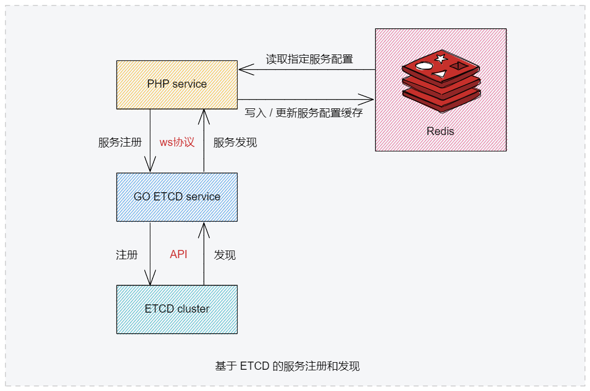

# php-service-discovery
webman 基于etcd服务注册发现组件

PHP版本，基于Workerman的ETCD服务注册和发现。 因为公司自身业务是需要和 gin（go框架）结合组成微服务，所以 ETCD 直接复用了go的代码。 

> 因为 go etcd websocket 服务固定需要占用 8083 端口，请确定自己系统没用占用否则报错！

- 支持 restful（http） 和 rpc 服务
- 支持 K8S service ip 自动获取，非K8S环境自动获取本地ip
- 支持 熔断器

# 架构

# 配合使用组件

| 名称 | 说明 |
|---|---|
| teamones/jsonrpc | json-rpc 2.0 组件|
| teamones/http | http 组件|
| teamones/breaker | 熔断器组件|